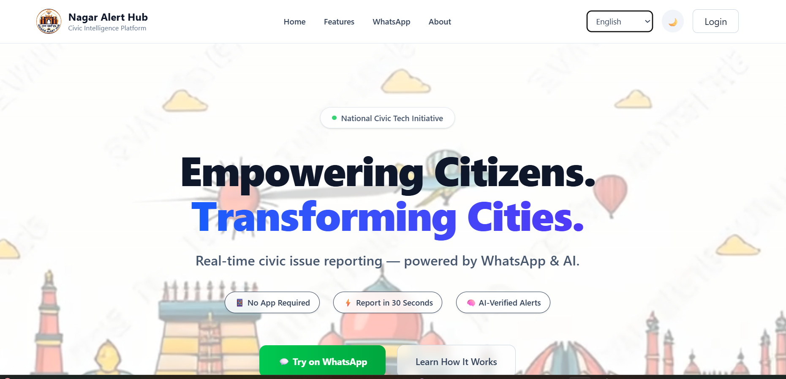
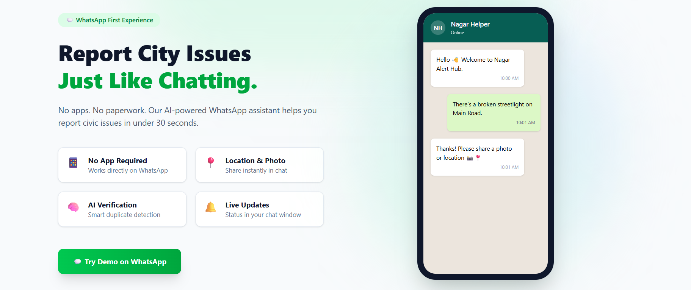

# TEAM-SYNC-AI for Bharat (Nagar Alert Hub)

Nagar Alert Hub is a civic intelligence platform focused on fast, inclusive issue reporting for Indian cities. The current repository contains a React + Vite frontend with citizen and admin dashboards, multilingual UX, and WhatsApp-first reporting flows.

## Screenshots





> Place image files at:
>
> - `frontend/public/1.png`
> - `frontend/public/2.png`

## Project Goals

- Remove app-download friction by supporting conversational civic reporting
- Improve authority response speed with centralized dashboards
- Reduce duplicate issue noise with clustering and AI-assisted workflows
- Make reporting accessible for diverse users and low-bandwidth contexts

## Key Modules

### Citizen Web Experience

- Dashboard with issue status and quick actions
- Report issue flow (media + location + category)
- Live map and report detail pages
- Notifications, achievements, leaderboard, profile, SOS, preferences

### Admin Web Experience

- Operational dashboard for monitoring incidents
- Incidents list and incident detail workflows
- Live map, analytics, task board, broadcast, profile, notifications, settings

## Tech Stack

- React 19
- React Router
- Vite 7
- Tailwind CSS 4
- Lucide icons
- React Hot Toast

## Repository Structure

```text
TEAM-SYNC-AI-for-Bharat/
├── design.md
├── requirements.md
├── docs/
│   └── images/
├── README.md
└── frontend/
    ├── package.json
    ├── index.html
    └── src/
        ├── App.jsx
        ├── AuthPages/
        ├── components/
        ├── context/
        ├── pages/
        │   ├── civic/
        │   └── admin/
        ├── services/
        └── utils/
```

## Getting Started

### Prerequisites

- Node.js 18+ (recommended 20+)
- npm 9+

### Install and Run

```bash
cd frontend
npm install
npm run dev
```

App runs by default at `http://localhost:5173`.

### Build

```bash
cd frontend
npm run build
npm run preview
```

## Environment Variables

Create `frontend/.env` (or `.env.local`) as needed:

```env
VITE_API_BASE_URL=http://localhost:5001
```

Only include variables actually used by your backend/frontend integration.

## Main Routes

### Public

- `/`
- `/how-it-works`
- `/municipalities`
- `/success-stories`
- `/privacy-policy`
- `/terms-of-service`
- `/login`
- `/register`

### Citizen

- `/civic/dashboard`
- `/civic/map`
- `/civic/report`
- `/civic/report/:id`
- `/civic/my-reports`
- `/civic/leaderboard`
- `/civic/achievements`
- `/civic/profile`
- `/civic/notifications`
- `/civic/guide`
- `/civic/sos`
- `/civic/preferences`
- `/civic/privacy`
- `/civic/data-usage`

### Admin

- `/admin/dashboard`
- `/admin/incidents`
- `/admin/incident/:id`
- `/admin/map`
- `/admin/analytics`
- `/admin/broadcast`
- `/admin/tasks`
- `/admin/profile`
- `/admin/notifications`
- `/admin/settings`

## Product Documentation

- `requirements.md` contains functional and non-functional requirements
- `design.md` contains architecture and design decisions

## Development Notes

- Keep UI changes consistent with existing Tailwind design patterns
- Prefer focused, small commits by module (auth, routing, civic, admin)
- Validate routes after navigation changes in `frontend/src/App.jsx`

## License

Internal/Project-specific. Add your final license policy here before public release.
